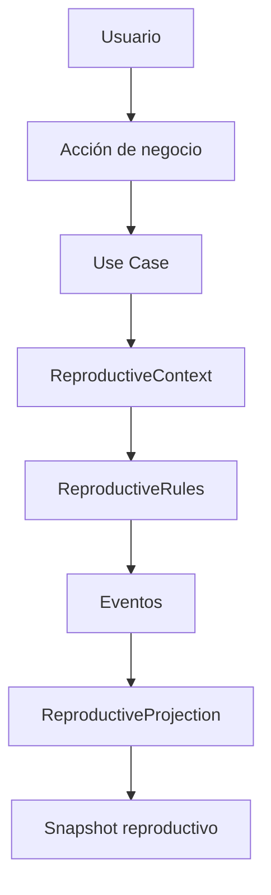

# Dominio Reproductivo

> Este documento describe la arquitectura del dominio.
>
> Los conceptos y reglas de negocio del modelo reproductivo se documentan en `documentacion/modelo/modelo_reproductivo.md`.

## Introducción

El dominio reproductivo es uno de los dominios especializados de la aplicación y es responsable de gestionar todo el conocimiento relacionado con el proceso reproductivo de los animales reproductores.

Su responsabilidad consiste en interpretar los eventos biológicos registrados para construir una representación coherente del estado reproductivo del animal y de la evolución de su ciclo reproductivo, proporcionando al resto del sistema una visión consistente, reutilizable y basada exclusivamente en hechos registrados.

A diferencia del dominio ganadero, que representa la realidad física de la explotación, el dominio reproductivo modela únicamente el conocimiento necesario para gestionar la reproducción de aquellos animales que participan en dicho proceso.

Este documento describe el propósito, alcance, principios y organización del dominio reproductivo.

La representación de este conocimiento mediante entidades, relaciones, estados y estructuras de datos se documenta en `modelo/modelo_reproductivo.md`.

---

# Índice

1. Objetivo
2. Alcance del dominio
3. Conceptos fundamentales
4. Principios del dominio
5. Organización interna
6. Componentes del dominio
7. Relación con los Use Cases
8. Relación con otros dominios
9. Estado actual
10. Evolución prevista

---

## Objetivo

El dominio reproductivo encapsula todo el conocimiento relacionado con la gestión reproductiva de la explotación.

Su finalidad es centralizar las reglas de negocio asociadas al ciclo reproductivo para que puedan ser reutilizadas por cualquier funcionalidad presente o futura, manteniendo separadas las decisiones de negocio de la infraestructura y de los casos de uso.

Para ello implementa el patrón arquitectónico **Context → Rules → Projection (CRP)** definido en:

```text
documentacion/arquitectura/patterns/context-rules-projection.md
```

Este documento recoge exclusivamente las decisiones específicas del dominio reproductivo.

Las reglas generales del patrón arquitectónico se documentan en el documento correspondiente.

---

## Visión general del dominio

El dominio reproductivo actúa como el núcleo de decisión de todas las funcionalidades relacionadas con la reproducción.

Los casos de uso no implementan reglas reproductivas.

Su única responsabilidad consiste en proporcionar al dominio la información necesaria para interpretar el evento solicitado y persistir posteriormente el resultado.



Este flujo resume el funcionamiento general del dominio y sirve como referencia para el resto del documento.

---

# Alcance del dominio

El dominio reproductivo es responsable de:

- interpretar los eventos reproductivos registrados;
- gestionar la evolución del ciclo reproductivo;
- determinar el estado reproductivo observable del animal;
- proyectar la información derivada necesaria para el resto del sistema;
- encapsular todas las reglas de negocio relacionadas con la reproducción.

No es responsable de:

- representar animales, lotes o movimientos;
- gestionar la persistencia de datos;
- implementar casos de uso;
- consultas SQL;
- RPC;
- infraestructura;
- interfaz de usuario.

Estas responsabilidades pertenecen a otros dominios o capas de la aplicación.

---

# Conceptos fundamentales

## Animal reproductor

No todos los animales de la explotación forman parte del dominio reproductivo.

Este dominio únicamente gestiona aquellos animales cuya finalidad productiva incluye la reproducción.

La pertenencia al dominio reproductivo no depende únicamente de la capacidad biológica del animal, sino de una decisión de negocio tomada por la explotación.

---

## Tipo productivo

El acceso al dominio reproductivo comienza con una decisión de negocio.

Un animal únicamente puede participar en el ciclo reproductivo cuando su **tipo_productivo** pasa a ser **REPRODUCTORA**.

Esta decisión pertenece al dominio ganadero y determina la finalidad productiva del animal dentro de la explotación.

Por tanto, la existencia del ciclo reproductivo no depende de la edad del animal, ni de su capacidad biológica para reproducirse, sino de la decisión explícita de utilizarlo como reproductor.

El dominio reproductivo nunca toma esta decisión; únicamente la utiliza como condición de entrada.

---

## Ciclo reproductivo

El ciclo reproductivo constituye la unidad funcional principal del dominio.

Agrupa todos los eventos que forman parte de un mismo proceso reproductivo y permite interpretar la evolución del animal a lo largo del tiempo como una única historia coherente.

Un ciclo reproductivo únicamente puede existir para animales cuya finalidad productiva sea la reproducción.

---

## Estado reproductivo

El estado reproductivo representa el mayor nivel de conocimiento confirmado que el sistema posee sobre la situación reproductiva actual del animal.

No pretende inferir la realidad biológica, sino reflejar exclusivamente los hechos registrados mediante eventos.

Su valor es siempre consecuencia de la interpretación realizada por este dominio.

---

# Relación con el modelo ganadero

El dominio reproductivo amplía el conocimiento representado por el dominio ganadero.

El dominio ganadero determina qué animales forman parte del proceso reproductivo mediante la asignación del tipo_productivo.

A partir de ese momento, el dominio reproductivo pasa a gestionar la evolución del ciclo reproductivo de dicho animal.

Ambos dominios comparten los mismos eventos físicos, pero cada uno los interpreta desde su propio ámbito de responsabilidad.

---

# Principios del dominio

Antes de definir las reglas concretas del dominio resulta importante comprender qué representa realmente este módulo.

El dominio reproductivo no pretende reconstruir con exactitud la realidad biológica del animal.

Su responsabilidad consiste en representar el mayor nivel de conocimiento confirmado que la explotación posee sobre dicha realidad en cada momento.

Como consecuencia, el dominio acepta que la información disponible puede ser incompleta o incierta. Todas las decisiones, estados y proyecciones se construyen exclusivamente a partir de los hechos registrados, sin inventar acontecimientos ni completar información ausente mediante inferencias.

Además de los principios generales definidos por la arquitectura del proyecto, el dominio reproductivo se rige por las siguientes reglas:

- el ciclo reproductivo constituye la unidad funcional principal del dominio;
- un animal únicamente puede participar en el dominio reproductivo cuando ha sido seleccionado como reproductor mediante `tipo_productivo = REPRODUCTORA`;
- el dominio reproductivo nunca decide qué animales son reproductores; consume dicha decisión del dominio ganadero;
- todo estado reproductivo deriva exclusivamente de eventos registrados;
- el dominio representa el conocimiento confirmado disponible, no una reconstrucción completa de la realidad biológica;
- la ausencia de información constituye una situación válida del dominio y nunca debe compensarse inventando eventos no registrados;
- el dominio nunca realiza inferencias biológicas no respaldadas por hechos registrados;
- la historia nunca se modifica;
- las proyecciones nunca constituyen la fuente de verdad;
- todas las reglas reproductivas deben permanecer centralizadas dentro de este dominio.
- el dominio únicamente representa conocimiento confirmado.

Las proyecciones podrán estimar información derivada (por ejemplo, fechas previstas), pero nunca crearán hechos biológicos inexistentes ni modificarán el historial de eventos registrado por el usuario.

Estos principios deberán respetarse en todas las futuras ampliaciones del módulo reproductivo.

---

# Organización interna

El dominio reproductivo implementa el patrón arquitectónico **Context → Rules → Projection (CRP)**.

La adopción de este patrón responde a la necesidad de encapsular un conjunto de reglas de negocio que evolucionan conjuntamente y son reutilizadas por múltiples casos de uso.

La arquitectura del dominio se organiza en:

```text
Reproductive Domain
    ↓
ReproductiveContext
    ↓
ReproductiveRules
    ↓
Domain Result
    ↓
ReproductiveProjection
    ↓
Snapshot reproductivo
```

Cada componente mantiene una única responsabilidad y colabora con el resto para interpretar los eventos reproductivos y construir el estado observable del dominio.

Los principios generales del patrón CRP se documentan en:

```text
documentacion/arquitectura/patterns/context-rules-projection.md
```

En este documento únicamente se describen las particularidades de su aplicación al dominio reproductivo.

---

# Componentes del dominio

## Responsabilidad de cada componente

| Componente | Responsabilidad     |
| ---------- | ------------------- |
| Context    | Reunir información  |
| Rules      | Tomar decisiones    |
| Projection | Construir snapshots |
| Snapshot   | Optimizar lectura   |


## ReproductiveContext

### Objetivo

Reunir toda la información necesaria para interpretar correctamente un evento reproductivo.

El Context representa el estado conocido del dominio antes de aplicar ninguna regla de negocio.

Inicialmente podrá contener:

* animal;
* ciclo reproductivo activo;
* último evento biológico;
* evento solicitado.

En futuras fases podrá ampliarse con nueva información siempre que sea necesaria para interpretar el dominio.

El Context nunca:

* interpreta reglas;
* modifica estados;
* calcula proyecciones;
* persiste información.

Su única responsabilidad consiste en proporcionar a las reglas todo el contexto necesario para tomar decisiones.

---

## ReproductiveRules

Las reglas del dominio encapsulan todo el conocimiento relacionado con la evolución del proceso reproductivo.

Se organizan en componentes especializados, cada uno con una responsabilidad claramente definida.

Inicialmente el dominio incorpora:

```text
ReproductiveEligibilityRules

ReproductiveCycleRules
```

Esta división podrá ampliarse conforme evolucione el módulo.

---

### ReproductiveEligibilityRules

Responsabilidad:

Determinar si un evento reproductivo puede registrarse.

Entre otras validaciones podrá comprobar:

* elegibilidad del animal;
* coherencia con el tipo productivo;
* compatibilidad del estado actual;
* restricciones biológicas;
* coherencia del evento solicitado.

Nunca modifica información.

Nunca construye snapshots.

Su única responsabilidad consiste en decidir si una operación es válida desde el punto de vista del dominio.

---

### ReproductiveCycleRules

Responsabilidad:

Interpretar la evolución del ciclo reproductivo.

Entre otras tareas:

* apertura de ciclos;
* reutilización de ciclos existentes;
* cierre de ciclos;
* interpretación de eventos biológicos;
* determinación del estado reproductivo;
* cálculo de la evolución del ciclo.

Nunca construye proyecciones.

Nunca realiza tareas orientadas exclusivamente a lectura.

Su responsabilidad consiste únicamente en interpretar las reglas del dominio.

ReproductiveCycleRules únicamente interpreta aquellos eventos clasificados como eventos biológicos dentro del dominio ganadero.

El dominio reproductivo no decide qué eventos son reproductivos; eso pertenece al dominio ganadero. El dominio reproductivo simplemente interpreta los eventos que ya han sido identificados como biológicos.

---

## ReproductiveProjection

### Objetivo

Construir la representación observable del estado reproductivo para el resto de la aplicación.

La Projection nunca toma decisiones de negocio.

La información proyectada constituye un snapshot derivado optimizado para consulta.

Inicialmente podrá incluir:

* estado reproductivo;
* identificador del ciclo activo;
* fecha prevista de parto;
* días restantes.

Las proyecciones podrán construirse tanto a partir de hechos registrados como de estimaciones derivadas cuando el dominio disponga de información suficiente.

El origen de dichas estimaciones forma parte del conocimiento del dominio y nunca altera la historia de eventos registrada.

Conforme evolucione el dominio podrán añadirse nuevas proyecciones derivadas sin modificar las reglas de negocio.

La Projection nunca interpreta eventos.

Únicamente transforma el resultado obtenido por las Rules en una representación persistible y eficiente para lectura.

---

# Snapshot reproductivo

El snapshot reproductivo representa una proyección derivada del historial de eventos.

Nunca constituye una fuente de verdad.

Toda la información persistida debe poder reconstruirse completamente a partir de los eventos registrados.

Su finalidad consiste exclusivamente en optimizar las consultas realizadas por el resto de la aplicación.

---

# Relación con los Use Cases

Cada funcionalidad reproductiva se implementa mediante un Use Case específico.

flowchart LR

subgraph Aplicación

UC[Use Case]

end

subgraph Dominio

CTX[Context]

RULES[Rules]

PROJ[Projection]

end

UC --> CTX

CTX --> RULES

RULES --> PROJ

El Use Case nunca implementa reglas reproductivas. Actúa exclusivamente como orquestador entre la infraestructura y el dominio.

El Use Case actúa como coordinador de la operación y es responsable de:

- construir el `ReproductiveContext`;
- invocar el dominio reproductivo;
- coordinar la persistencia de los cambios;
- devolver el resultado de la operación.

Toda la lógica de negocio relacionada con la reproducción permanece encapsulada dentro del dominio reproductivo.

Esta separación permite mantener los Use Cases pequeños, independientes y centrados exclusivamente en la orquestación de la operación.

---

# Relación con otros dominios

El dominio reproductivo forma parte de la arquitectura de dominios de la aplicación y mantiene una relación de dependencia funcional con el dominio ganadero.

```text
Ganadero
    │
    ▼
Reproductivo
```

El dominio ganadero representa la realidad física de la explotación y es responsable de conceptos fundamentales como:

- animales;
- lotes;
- eventos;
- movimientos;
- tipo productivo.

El dominio reproductivo utiliza estos conceptos para construir conocimiento especializado sobre la reproducción, pero nunca redefine ni modifica su significado.

Esta relación convierte al dominio ganadero en la fuente de verdad de la realidad física de la explotación, mientras que el dominio reproductivo constituye una interpretación especializada de esa realidad para la gestión reproductiva.

En particular, la decisión de que un animal participe en el proceso reproductivo pertenece exclusivamente al dominio ganadero mediante la asignación del `tipo_productivo`.

Una vez que un animal pasa a tener `tipo_productivo = REPRODUCTORA`, el dominio reproductivo puede comenzar a gestionar su ciclo reproductivo.

Otros dominios especializados, como Financiero, Sanitario u Operacional, podrán relacionarse con el dominio ganadero siguiendo el mismo principio de separación de responsabilidades y podrán implementar el mismo patrón CRP mediante sus propios Context, Rules y Projection especializados.

---

# Estado actual del dominio

El dominio reproductivo constituye actualmente el primer dominio especializado construido sobre el patrón **Context → Rules → Projection (CRP)**.

La primera funcionalidad implementada corresponde al registro de cubriciones, que valida la arquitectura y establece la base para la incorporación del resto de procesos reproductivos.

El dominio crecerá incorporando nuevos eventos reproductivos (parto, aborto, destete...) sin modificar la arquitectura existente.

La evolución del dominio se realizará ampliando las reglas existentes y reutilizando los mismos componentes arquitectónicos, evitando la duplicación de lógica entre distintos casos de uso.

**Funcionalidades implementadas:**
- Cubrición — abre ciclo, calcula `fecha_prevista_parto`, transición `vacia/cubierta → cubierta`
- Confirmación de gestación — reutiliza ciclo, transición `cubierta → gestante`

Ambas funcionalidades validan la arquitectura CRP y establecen los componentes reutilizables
(`ReproductiveContext`, `ReproductiveEligibilityRules`, `ReproductiveCycleRules`, `ReproductiveProjection`)
sobre los que se construirán los próximos eventos reproductivos.

---

# Evolución prevista

El dominio reproductivo está diseñado para evolucionar de forma incremental sin modificar su arquitectura fundamental.

Entre las futuras capacidades del dominio se incluyen:

- parto;
- aborto;
- destete;
- sincronización reproductiva;
- automatizaciones;
- alertas reproductivas;
- planificación y seguimiento del calendario reproductivo;
- nuevas proyecciones derivadas.

Cada nueva funcionalidad reutilizará los componentes existentes del dominio, ampliando las reglas de negocio cuando sea necesario, pero manteniendo la misma estructura arquitectónica.

---

# Referencias

Arquitectura

- `documentacion/arquitectura/patterns/context-rules-projection.md`

Modelo

- `documentacion/modelo/modelo_ganadero.md`
- `documentacion/modelo/modelo_reproductivo.md`

Dominios relacionados

- `documentacion/dominios/ganadero.md`