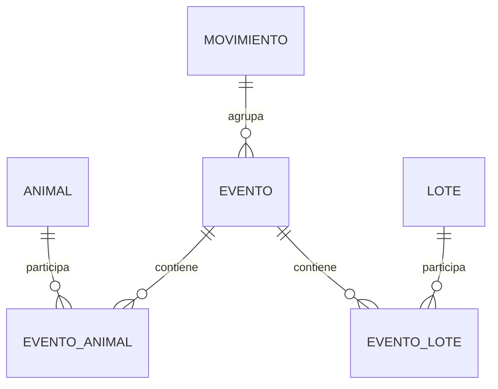
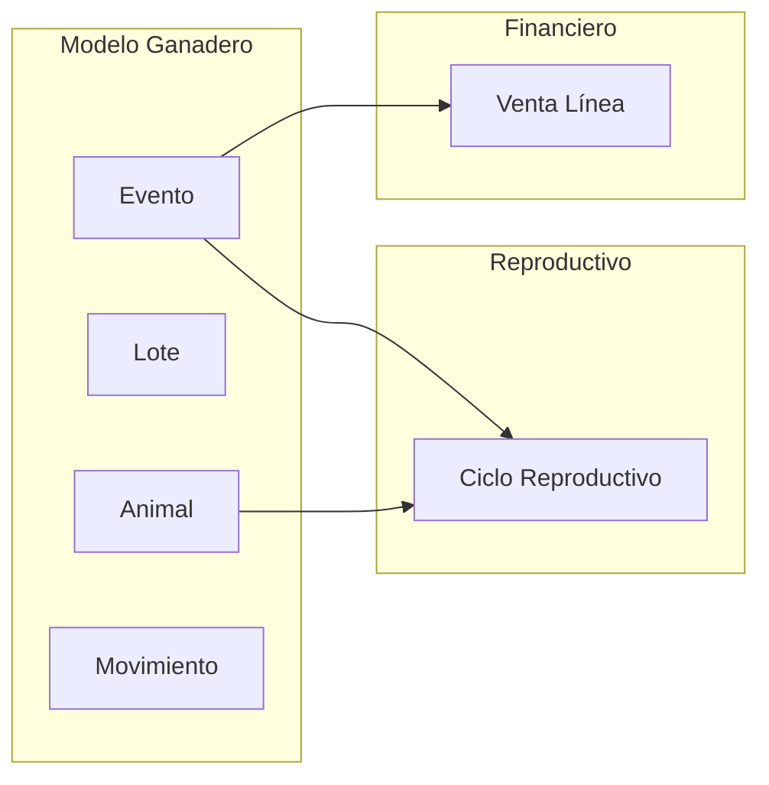
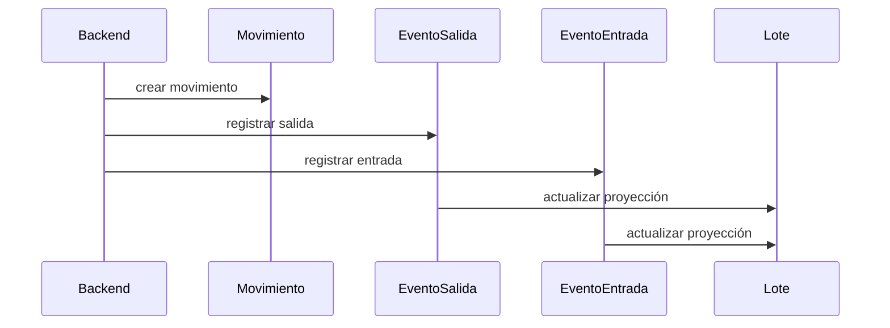

# Modelo Ganadero

## Introducción

El Modelo Ganadero constituye el núcleo conceptual sobre el que se construye toda la aplicación.

Su objetivo es representar de forma consistente la realidad física de una explotación ganadera mediante un conjunto de entidades persistentes, eventos y proyecciones derivadas que puedan ser compartidos por el resto de dominios del sistema.

Mientras que `dominios/ganadero.md` describe los principios y las reglas que gobiernan el dominio ganadero, este documento define cómo dichos conceptos se representan dentro del modelo.

El Modelo Ganadero no pretende resolver funcionalidades concretas, sino proporcionar un lenguaje común y una estructura estable sobre la que puedan construirse dominios especializados como el reproductivo, sanitario, financiero u operacional.

Por este motivo, cualquier nuevo dominio deberá reutilizar las entidades definidas en este documento antes de introducir nuevas estructuras propias.

---

# Índice

1. Objetivo
2. Principios del modelo
3. Fundamentos del modelo
4. Alcance del modelo
5. Entidades principales
   - Clasificación del modelo
   - Diagrama del modelo ganadero
   - Relaciones con otros modelos
   - Propietarios del modelo
6. Elemento central del modelo
7. Animal
   - Responsabilidades
   - Información persistente
   - Información derivada
   - Estados del animal
8. Lotes
9. Stock
10. Movimientos
11. Invariantes del modelo
12. Conclusiones
13. Relación con el resto de la Base de Conocimiento

---

## Objetivo

Este documento tiene como finalidad describir el modelo conceptual persistente del Core Domain.

En él se documentan:

- las entidades fundamentales del dominio;
- las relaciones existentes entre ellas;
- las proyecciones utilizadas para facilitar la operación diaria;
- las invariantes que garantizan la coherencia del modelo;
- los límites del modelo ganadero respecto a otros dominios.

No pretende describir procesos funcionales concretos ni reglas específicas de dominios especializados como el reproductivo, sanitario o financiero.

---

## Principios del modelo

El modelo ganadero se construye sobre los principios definidos en `dominios/ganadero.md`.

Como consecuencia de dichos principios, toda representación persistente del dominio debe respetar las siguientes reglas:

- los eventos constituyen la fuente de verdad del sistema;
- las entidades representan elementos persistentes de la realidad de la explotación;
- los estados observables son proyecciones derivadas del historial de eventos;
- las decisiones de negocio forman parte del modelo cuando modifican la realidad compartida;
- cualquier estado observable debe poder reconstruirse a partir de los hechos registrados;
- ningún dominio especializado redefine los conceptos fundamentales del Core Domain.

---

# Fundamentos del modelo

El sistema NO modela únicamente entidades.

Modela:
- hechos físicos,
- evolución temporal,
- relaciones históricas.

El modelo está basado en:

```txt
EVENTOS → generan realidad derivada
```

Por tanto:

```txt
stock
estado
ciclo
situación sanitaria
```

son derivados.

* **Entidades persistentes** → representan la realidad estable
* **Eventos** → representan su evolución
* **Proyecciones** → representan el estado observable derivado de dicha evolución

Esta separación constituye la base de todo el modelo.

---

# Alcance del modelo

Este documento describe únicamente el modelo conceptual compartido del dominio ganadero.

Las reglas específicas de los dominios especializados, como reproducción, sanidad o gestión financiera, se documentan en sus respectivos modelos, reutilizando las entidades aquí definidas.

## Qué no modela este documento

Este documento no describe la lógica de negocio de los dominios especializados ni las decisiones de implementación del sistema.

En particular, no define:

- reglas reproductivas;
- reglas sanitarias;
- procesos financieros;
- casos de uso;
- arquitectura software;
- infraestructura;
- persistencia física.

Su única responsabilidad consiste en describir la representación conceptual compartida sobre la que se apoyan dichos elementos.

---

# Objetivos del modelo

El Modelo Ganadero ha sido diseñado para cumplir los siguientes objetivos:

- representar fielmente la realidad física de la explotación;
- mantener la trazabilidad completa de todos los hechos registrados;
- permitir la reconstrucción del estado del sistema a partir de los eventos;
- proporcionar un lenguaje común para todos los dominios especializados;
- desacoplar el modelo conceptual de su implementación técnica;
- facilitar la evolución futura del sistema sin comprometer la coherencia del dominio.

---

# Entidades principales

## Clasificación del modelo

El modelo se divide en tres tipos de entidades:

- **Entidades núcleo** (de negocio)
- **Entidades auxiliares** (catálogos)
- **Proyecciones**

## Entidades núcleo (de negocio)

Representan la realidad persistente.

    - Animal
    - Lote
    - Evento
    - Movimiento

## Entidades auxiliares (catálogos)

Describen el contexto del modelo, conocimiento relativamente estable.

    - TipoEvento
    - MotivoMovimiento
    - TipoProductivo
    - Raza
    - Ubicación

Son entidades persistentes, pero no evolucionan como un Animal.

## Proyecciones

No representan cosas.

Representan conocimiento derivado.

    - EstadoVital
    - EstadoSanitario
    - EstadoReproductivo
    - Stock
    - Ubicación actual


## Diagrama del modelo ganadero

¿Cuáles son las entidades que forman el núcleo del modelo ganadero y cómo se relacionan entre sí?



## Relaciones con otros modelos



Las flechas representan dependencias conceptuales entre dominios, no relaciones físicas de persistencia.

## Integración con otros dominios

El Modelo Ganadero actúa como origen de la información utilizada por otros dominios especializados.

Cada dominio reutiliza las entidades del modelo sin modificar su significado.

Uno de los ejemplos más representativos es el dominio financiero.

Cuando un evento ganadero genera una operación económica, dicha relación no se establece directamente con la entidad Venta, sino mediante la entidad **Venta Línea**, que actúa como puente entre ambos modelos.

```text
Evento
        │
        ▼
Venta Línea
        │
        ▼
Venta
        │
        ▼
Factura
        │
        ▼
Transacción
```

Esta separación permite que un mismo evento pueda participar en procesos económicos sin introducir dependencias directas entre el modelo ganadero y el financiero, manteniendo ambos dominios desacoplados.

## Propietarios del modelo (ownership)

Cada concepto del modelo posee un único dominio propietario.

Ese dominio es el único autorizado para definir su significado y su evolución conceptual.

Los demás dominios pueden reutilizar dichos conceptos, pero nunca redefinirlos ni asumir su responsabilidad.

| Entidad            | Dominio propietario | Utilizada por                       |
| ------------------ | ------------------- | ----------------------------------- |
| Animal             | Ganadero            | Reproductivo, Sanitario, Financiero |
| Lote               | Ganadero            | Financiero                          |
| Evento             | Ganadero            | Todos los dominios                  |
| Movimiento         | Ganadero            | Ganadero                            |
| Ciclo Reproductivo | Reproductivo        | Ganadero (consulta)                 |
| Venta              | Financiero          | Financiero                          |
| Venta Línea        | Financiero          | Ganadero, Financiero                |

## Relaciones entre entidades

Las entidades del modelo no evolucionan de forma aislada.

Su evolución queda registrada mediante eventos, que actúan como mecanismo de coordinación entre ellas.

De esta forma:

- un Animal participa en eventos;
- un Lote participa en eventos;
- un Movimiento agrupa eventos;
- las proyecciones se actualizan como consecuencia de dichos eventos.

Esta arquitectura evita dependencias directas entre entidades y garantiza que toda modificación de la realidad quede correctamente trazada.

---

# Elemento central del modelo

Aunque el modelo está formado por múltiples entidades, el Evento ocupa una posición central. 

Los animales, lotes, movimientos y el resto de conceptos describen la realidad persistente de la explotación, pero es el Evento el que registra su evolución. 

Todas las proyecciones del sistema, así como gran parte de las interacciones con otros dominios, se construyen a partir del historial de eventos.

Ninguna proyección del sistema constituye una fuente de verdad por sí misma. Todas derivan, directa o indirectamente, del historial de eventos.

Esto no convierte al Evento en la entidad principal del modelo, sino en el mecanismo mediante el cual el resto de entidades evolucionan de forma trazable.

# Animal

## Qué representa

La entidad **Animal** representa un individuo físico identificable cuya evolución puede seguirse de forma independiente a lo largo del tiempo.

Constituye la unidad básica del modelo ganadero para todas aquellas especies o fases productivas en las que es necesario realizar trazabilidad individual.

Cada animal mantiene una identidad única durante toda su vida. Su información estructural permanece estable, mientras que su estado observable evoluciona a través de los eventos registrados y se expone mediante proyecciones derivadas.

---

## Responsabilidades

La entidad Animal es responsable de representar la información estructural y permanente del individuo.

Entre sus principales responsabilidades se encuentran:

- mantener la identidad única del animal;
- representar sus características permanentes (especie, sexo, raza, fecha de nacimiento, identificación, etc.);
- almacenar su clasificación productiva;
- servir como punto de acceso a las proyecciones derivadas utilizadas por el sistema para conocer su estado actual.

La entidad Animal no es responsable de calcular dichos estados. Su única responsabilidad es exponer las proyecciones generadas a partir del historial de eventos.

---

## Información persistente

La información persistente representa aquellas características propias del animal que únicamente cambian cuando existe una decisión explícita o un nuevo hecho registrado.

Algunos ejemplos son:

- identificación;
- especie;
- sexo;
- raza;
- fecha de nacimiento;
- tipo productivo;
- genealogía.

---

## Información derivada

Además de la información persistente, la entidad Animal expone diversas proyecciones derivadas que facilitan las consultas más habituales del sistema.

Estas proyecciones no constituyen la fuente de verdad y nunca deben modificarse manualmente.

Entre ellas se encuentran:

- estado vital;
- estado sanitario;
- estado reproductivo;
- lote actual;
- ubicación actual.

---

## Estados del animal

El Animal expone diferentes estados observables que representan una instantánea de su situación actual.

Estos estados no forman parte de la información estructural del animal, sino que son proyecciones derivadas del historial de eventos registradas para optimizar las consultas del sistema.

Todos ellos pueden reconstruirse en cualquier momento a partir de los eventos persistidos.

---

### Estado vital

Representa la situación del animal respecto a su permanencia dentro de la explotación.

| Estado | Significado |
|--------|-------------|
| VIVO | Animal activo dentro de la explotación. |
| VENDIDO | Animal que ha abandonado la explotación mediante una venta. |
| MUERTO | Animal fallecido. |

El estado vital tiene prioridad sobre el resto de estados observables. Cuando un animal pasa a estado **VENDIDO** o **MUERTO**, cualquier información derivada deja de tener relevancia operativa, aunque se conserva íntegramente con fines históricos y de trazabilidad.

---

### Estado sanitario

Representa la situación sanitaria observable del animal en un momento determinado.

| Estado | Significado |
|--------|-------------|
| SANO | Sin incidencias sanitarias registradas. |
| EN_OBSERVACION | Existe una incidencia pendiente de evaluación. |
| EN_TRATAMIENTO | El animal está sometido a un tratamiento activo. |
| NO_APTO | El animal queda temporal o permanentemente fuera del circuito productivo por motivos sanitarios. |

El estado sanitario evoluciona de forma independiente al resto de estados del animal y deriva exclusivamente de los eventos sanitarios registrados.

---

### Estado reproductivo

Representa la situación biológica observable del animal dentro del ciclo reproductivo.

A diferencia del estado vital o sanitario, el estado reproductivo únicamente existe para aquellos animales que participan en el dominio reproductivo.

La participación en dicho dominio no depende de un hecho biológico, sino de una decisión de negocio representada mediante el **tipo productivo**.

Cuando un animal pasa a tener el tipo productivo **REPRODUCTORA**, el sistema crea un ciclo reproductivo y proyecta el estado inicial **VACÍA**.

A partir de ese momento, el estado reproductivo evoluciona exclusivamente mediante los eventos reproductivos registrados.

| Estado | Significado |
|--------|-------------|
| VACÍA | El animal pertenece al dominio reproductivo y no existe una gestación en curso. |
| CUBIERTA | Se ha registrado una cubrición, pero la gestación todavía no ha sido confirmada. |
| GESTANTE | Existe una gestación confirmada. |
| LACTANTE | El animal ha parido y permanece en el periodo de lactancia. |

El detalle completo del ciclo reproductivo, sus transiciones y sus reglas de negocio se documenta en **modelo_reproductivo.md**.

---

## Proyecciones derivadas

Las proyecciones del modelo existen para facilitar las consultas operativas del sistema.

No constituyen la fuente de verdad y nunca deben modificarse manualmente.

Todas ellas derivan del historial de eventos registrados y pueden reconstruirse en cualquier momento.

Entre otras, el modelo proyecta:

- estado vital;
- estado sanitario;
- estado reproductivo;
- lote actual;
- ubicación actual;
- stock.

El backend es el responsable de mantener estas proyecciones sincronizadas con los eventos registrados.

---

## Separación entre clasificación y estado

El modelo distingue claramente entre la clasificación productiva de un animal y su estado biológico.

El **tipo productivo** representa una decisión de negocio sobre el papel que desempeña el animal dentro de la explotación.

El **estado reproductivo**, en cambio, representa una proyección biológica derivada del ciclo reproductivo.

Ambos conceptos son independientes y responden a preguntas diferentes:

- **Tipo productivo:** ¿Qué función desempeña este animal dentro de la explotación?
- **Estado reproductivo:** ¿Cuál es su situación biológica actual dentro del ciclo reproductivo?

Esta separación permite que el modelo represente correctamente tanto las decisiones de gestión como la evolución biológica del animal sin mezclar responsabilidades.

---

# Lotes

## Qué representan

La entidad **Lote** representa una agrupación física de animales utilizada para facilitar la gestión operativa de la explotación.

Un lote no constituye una unidad biológica ni una entidad permanente. Su existencia responde exclusivamente a necesidades organizativas, productivas o logísticas.

Un mismo animal puede pertenecer a distintos lotes a lo largo de su vida sin que ello afecte a su identidad.

---

## Responsabilidades

La entidad Lote es responsable de:

- agrupar animales para facilitar su gestión;
- servir como origen o destino de movimientos;
- permitir el cálculo del stock existente en cada agrupación;
- facilitar operaciones masivas sobre conjuntos de animales.

El lote nunca constituye la fuente de verdad del sistema. Su composición actual siempre puede reconstruirse a partir del historial de eventos registrados.

---

## Tipos de lote

El modelo no impone una clasificación cerrada de lotes.

Cada especie o sistema productivo podrá definir los tipos de lote que necesite siempre que respeten el modelo general.

Ejemplos habituales son:

| Tipo | Finalidad |
|--------|-----------|
| Camada | Agrupar animales recién nacidos. |
| Post-destete | Agrupar animales durante la transición tras el destete. |
| Engorde | Agrupar animales destinados a la fase de engorde. |
| Cuarentena | Agrupar animales aislados temporalmente por motivos sanitarios. |

La incorporación de nuevos tipos de lote no requiere modificar el modelo conceptual.

---

# Stock

## Qué representa

El stock representa la cantidad observable de animales presentes en un determinado lote en un instante concreto.

Se trata de una proyección derivada cuyo objetivo es optimizar las consultas operativas del sistema.

---

## Fuente de verdad

El stock nunca constituye la fuente de verdad.

La composición real de un lote siempre puede reconstruirse a partir del historial completo de eventos registrados.

La proyección de stock existe únicamente para evitar reconstruir dicho historial en cada consulta.

---

## Cálculo

Conceptualmente, el stock puede representarse como:

```txt
Stock actual =
Entradas
− Salidas
± Ajustes
```

La implementación concreta del algoritmo puede evolucionar sin modificar este modelo conceptual.
---

# Movimientos

## Qué representan

La entidad **Movimiento** representa una operación lógica que agrupa varios eventos relacionados entre sí.

Su objetivo es mantener la trazabilidad de operaciones que implican más de un cambio dentro de la explotación.

El movimiento no modifica directamente el estado del sistema.

Los únicos elementos que producen cambios son los eventos asociados.

---

## Ejemplo conceptual

Un traslado entre lotes se representa mediante dos eventos independientes:

```txt
Salida del lote origen
Entrada en el lote destino
```

Ambos eventos quedan agrupados bajo un único movimiento que representa la operación realizada.

---

## Responsabilidades

La entidad Movimiento es responsable de:

- agrupar eventos relacionados;
- mantener la trazabilidad de operaciones complejas;
- permitir auditorías posteriores;
- facilitar la reconstrucción de operaciones realizadas.

No representa una fuente de verdad independiente del historial de eventos.

---

## Relación entre movimientos y eventos

La siguiente secuencia ilustra una posible implementación conceptual de un movimiento entre lotes.



El orden exacto de ejecución podrá variar según la implementación, siempre que se preserve la atomicidad de la operación y la consistencia del modelo.

---

# Invariantes del modelo

Las siguientes reglas forman parte del modelo conceptual y deben cumplirse independientemente de la tecnología utilizada para implementarlo.

## Trazabilidad

Toda modificación de la realidad de la explotación debe quedar registrada mediante uno o varios eventos.

Ningún cambio persistente puede producirse sin dejar constancia de los hechos que lo originaron.

---

## Consistencia

Las proyecciones nunca constituyen la fuente de verdad.

Su único objetivo es facilitar las consultas del sistema.

En caso de discrepancia, el historial de eventos prevalece siempre sobre cualquier proyección.

---

## Integridad

Las relaciones entre entidades deben mantenerse siempre consistentes.

No pueden existir referencias a entidades inexistentes ni operaciones que dejen el modelo en un estado inválido.

---

## Atomicidad

Las operaciones que generan varios eventos relacionados deben ejecutarse como una única unidad lógica.

El sistema nunca debe dejar registrada únicamente una parte de una operación.

---

## Reconstrucción

El estado observable del sistema debe poder reconstruirse completamente a partir del historial de eventos registrados.

La pérdida de cualquier proyección no debe implicar pérdida de información de negocio.

---

# Conclusiones

El Modelo Ganadero constituye la base conceptual compartida sobre la que se construyen el resto de dominios funcionales de la aplicación.

Su objetivo no es describir procesos concretos ni implementar reglas específicas de negocio, sino proporcionar una representación consistente, trazable y evolutiva de la realidad de la explotación.

Para ello distingue claramente entre:

- entidades persistentes;
- eventos que describen su evolución;
- proyecciones utilizadas para optimizar la consulta del estado actual.

Esta separación permite que el sistema mantenga un único origen de la verdad, garantice la trazabilidad completa de todas las operaciones y facilite la evolución independiente de los distintos dominios especializados sin comprometer la coherencia del modelo.

---

## Relación con el resto de la Base de Conocimiento

Este documento define el modelo conceptual compartido del dominio ganadero.

Los documentos especializados amplían este modelo sin redefinir sus conceptos fundamentales.

Entre ellos destacan:

- `dominios/ganadero.md`, que describe los principios del dominio ganadero.
- `modelo_reproductivo.md`, que desarrolla el modelo conceptual del dominio reproductivo.
- `backend_spec.md`, que documenta la implementación técnica y la persistencia del modelo.
- `frontend_spec.md`, que describe la representación del modelo en la interfaz de usuario.

Todos ellos deben interpretarse como especializaciones o implementaciones del presente modelo, nunca como definiciones alternativas del mismo.

---

# Referencias

Dominio relacionado

- documentacion/dominios/ganadero.md

Modelos relacionados

- documentacion/modelo/modelo_reproductivo.md

Arquitectura

- documentacion/arquitectura/overview.md