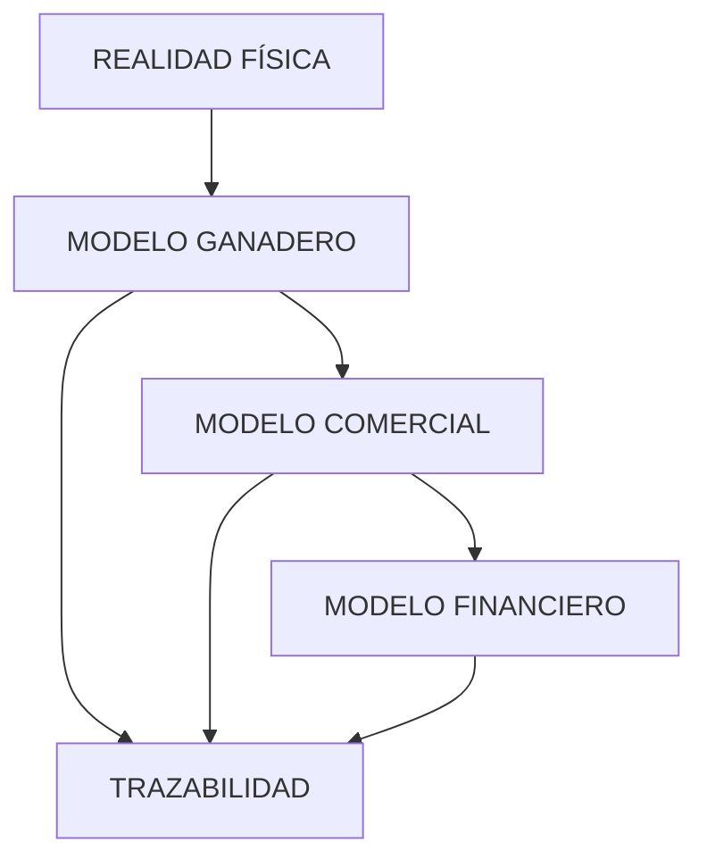

# 🧠 Modelo Conceptual del Sistema

## Filosofía general

Este proyecto no modela únicamente datos.
Modela la realidad física, comercial y económica de una explotación ganadera.

El sistema está construido alrededor de un principio fundamental:

> Los EVENTOS son la única fuente de verdad.

Todo lo demás:
- estados,
- stock,
- ciclos,
- métricas,
- dinero,
- dashboards,
- trazabilidad,

son derivados de los eventos.

---

# 🧭 Mapa conceptual global



---

# 🐄 Capas del sistema

| Capa | Qué representa |
|---|---|
| Ganadero | Realidad física de la explotación |
| Eventos | Hechos históricos que ocurren |
| Comercial | Operaciones de negocio |
| Financiero | Dinero y documentos |
| Trazabilidad | Reconstrucción histórica |

---

# 🧱 Principios arquitectónicos

## 1. Eventos como fuente de verdad

Nada importante debe existir sin evento.

Ejemplos:
- un animal debe tener evento de creación
- un movimiento debe tener eventos asociados
- un estado debe derivarse de eventos

---

## 2. Estados derivados

Los estados NO son editables manualmente.

Se recalculan a partir de eventos.

Ejemplo:

```txt
PARTO
→ estado_reproductivo = LACTANTE
```

---

## 3. Separación conceptual

Aunque algunas entidades hoy parezcan similares, NO representan lo mismo.

Ejemplo:

| Entidad | Qué representa |
|---|---|
| Factura | Documento externo |
| Transacción | Movimiento económico |
| Venta | Operación comercial |
| Evento | Realidad física |

---

## 4. Trazabilidad total

El sistema debe permitir reconstruir:

```txt
factura
→ factura_linea
→ venta_linea
→ evento
→ animal/lote
```

---

# 🧬 Dominios principales

## 🐄 Modelo ganadero

Describe:
- animales
- lotes
- reproducción
- estados
- movimientos
- stock

📄 Ver: `ganadero.md`

---

## ⚡ Modelo de eventos

Describe:
- eventos
- tipos de evento
- motivos
- movimientos
- inmutabilidad
- derivación de estados

📄 Ver: `eventos.md`

---

## 💰 Modelo financiero

Describe:
- ventas
- facturas
- transacciones
- previsión vs realidad
- ingresos y gastos

📄 Ver: `financiero.md`

---

## 🔗 Modelo de trazabilidad

Describe:
- relaciones históricas
- trazabilidad animal
- trazabilidad económica
- reconstrucción histórica

📄 Ver: `trazabilidad.md`

---

# 🧱 Flujo global del sistema


---

# 🧠 Filosofía de implementación

## Backend decide

El backend contiene:
- lógica de negocio
- validaciones
- máquinas de estado
- coordinación de operaciones

---

## Base de datos protege

La BD garantiza:
- integridad referencial
- constraints
- unicidad
- coherencia mínima

---

## Triggers mínimos

Los triggers:
- NO contienen lógica compleja
- solo protegen invariantes críticas

---

# 🔒 Invariantes globales

## Críticas

```txt
1. eventos son inmutables
2. stock nunca negativo
3. un solo ciclo abierto
4. estados derivados
5. movimientos atómicos
6. trazabilidad preservada
7. validar antes de persistir
```

---

# 🚜 Filosofía de evolución

El sistema se desarrolla:
- paso a paso
- incrementalmente
- preservando semántica
- evitando sobreingeniería

La prioridad es:

```txt
claridad > complejidad
semántica > conveniencia
consistencia > velocidad
```
