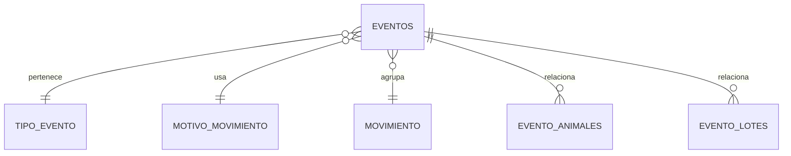
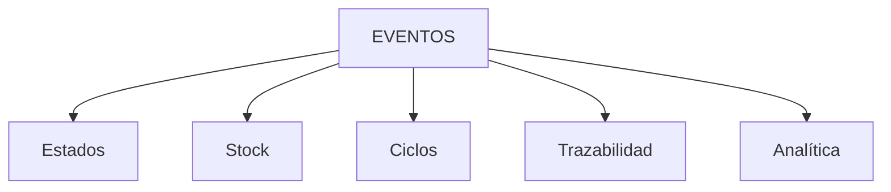
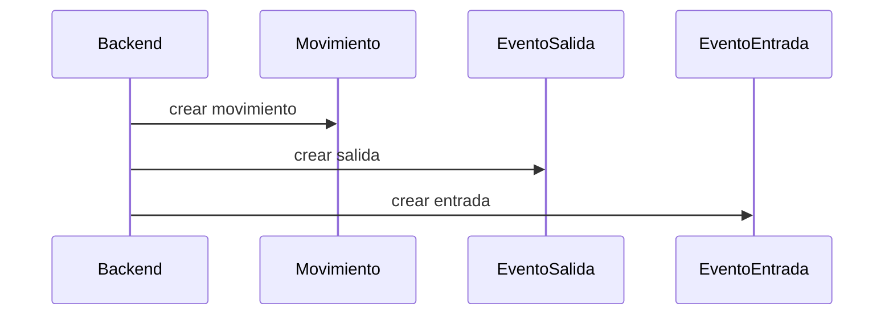
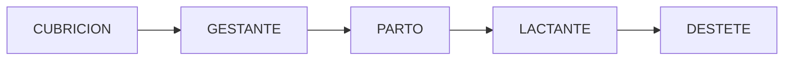
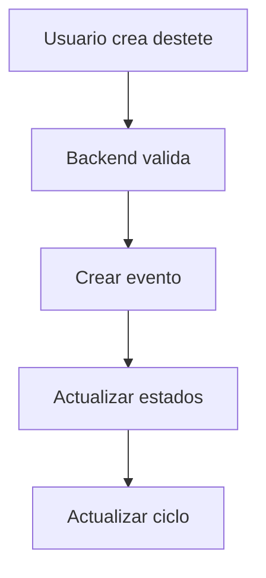

## 📄 `eventos.md`

# ⚡ Modelo de Eventos

## Filosofía central

El sistema es event-driven.

Todo hecho importante se representa mediante un evento.

Los eventos son:
- inmutables,
- históricos,
- auditables,
- trazables.

---

# 🧠 Principio fundamental

```txt
Los EVENTOS son la única fuente de verdad.
```

Todo lo demás:
- estados,
- stock,
- dashboards,
- métricas,
- trazabilidad,

se deriva de eventos.

---

# 🧱 Qué es un evento

Un evento representa:

> algo que realmente ocurrió.

Ejemplos:
- parto
- cubrición
- muerte
- venta
- movimiento
- entrada de animales
- tratamiento sanitario

---

# 🧬 Estructura conceptual



---

# 📦 Tipos de eventos

| Tipo | Ejemplos |
|---|---|
| Reproductivos | cubrición, parto, aborto |
| Sanitarios | tratamiento, observación |
| Stock | entrada, salida, traslado |
| Económicos | venta |
| Sistema | ajustes, compensaciones |

---

# 🔒 Inmutabilidad

## Regla crítica

```txt
Un evento NO se edita.
Un evento NO se elimina.
```

---

## Correcciones

Las correcciones se realizan mediante:

```txt
eventos compensatorios
```

Ejemplo:

```txt
Entrada incorrecta
→ crear salida compensatoria
```

---

# 🔄 Flujo de derivación



---

# 🧱 Relaciones de eventos

## EVENTO_ANIMALES

Relaciona:

```txt
evento ↔ animales
```

---

## EVENTO_LOTES

Relaciona:

```txt
evento ↔ lotes
```

---

## MOVIMIENTO

Agrupa eventos coordinados.

Ejemplo:

```txt
salida lote A
entrada lote B
```

---

# 🔄 Movimiento entre lotes



---

# 🧬 Eventos reproductivos

## Flujo



---

# 🩺 Eventos sanitarios

## Filosofía

El detalle NO vive en estados.

El detalle vive en eventos.

Ejemplo:

```json
{
  "tipo": "diarrea",
  "gravedad": "media",
  "tratamiento": "antibiotico"
}
```

---

# ⚠️ Motivos de movimiento

## Qué representan

El motivo define:
- por qué ocurre el evento
- dirección
- impacto económico

---

# 🔗 Relación con financiero

Los motivos contienen:

| Campo | Función |
|---|---|
| es_monetizable | activa lógica económica |
| tipo_economico | ingreso/gasto |

---

# 🔥 Punto crítico

El motivo:

```txt
NO crea documentos
NO crea facturas
```

Solo:

```txt
activa lógica económica
```

---

# 🧱 Backend vs Base de Datos

## Backend

El backend:
- decide lógica
- valida transiciones
- crea eventos derivados
- coordina operaciones

---

## Base de datos

La BD:
- protege integridad
- evita incoherencias básicas
- protege stock
- valida constraints

---

# 🔒 Invariantes críticas

| Regla | Descripción |
|---|---|
| Eventos inmutables | nunca editar |
| Coherencia temporal | no romper secuencia |
| FK válidas | relaciones correctas |
| Stock >= 0 | nunca negativo |
| Un ciclo abierto | máximo uno |

---

# 🧭 Flujo UX → Eventos



---

# 🧠 Filosofía final

El modelo de eventos permite:
- trazabilidad,
- reconstrucción histórica,
- consistencia,
- auditoría,
- derivación de estados,
- evolución futura.

Es el corazón del sistema.
