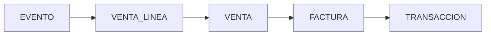
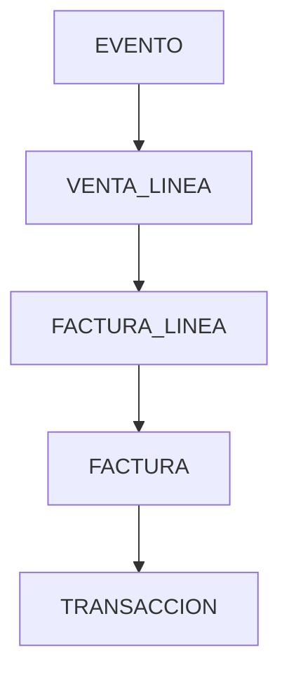
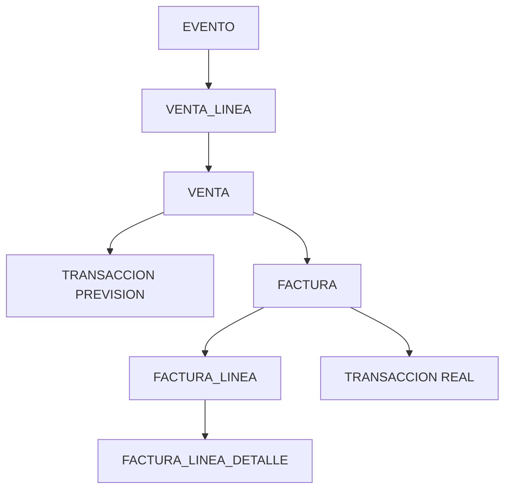
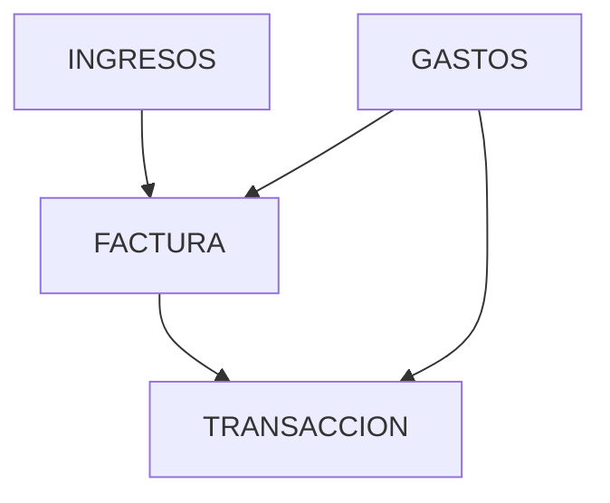
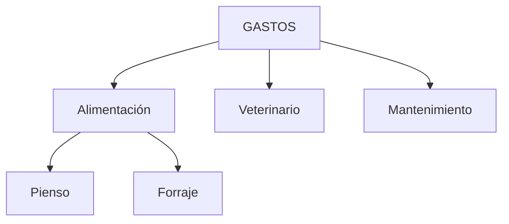

## 📄 Modelo Financiero

# 💰 Modelo Financiero

# Objetivo

El modelo financiero representa:
- operaciones comerciales,
- documentos,
- dinero,
- previsión,
- realidad económica.

El sistema separa deliberadamente:

```txt
realidad física
operación comercial
documento económico
dinero
```

---

# 🧭 Filosofía general

El modelo financiero NO gira alrededor de facturas.

Gira alrededor de:

```txt
la operación comercial
```

---

# 🔥 Insight clave

```txt
EVENTO = realidad física
VENTA = operación comercial
FACTURA = documento
TRANSACCION = dinero
```

---

# 🧱 Flujo conceptual



---

# 🧠 Capas del modelo

| Capa | Qué representa |
|---|---|
| evento | realidad física |
| venta_linea | traducción comercial |
| venta | acuerdo comercial |
| factura | documento externo |
| transaccion | dinero |

---

# 🔥 venta_linea: el puente clave

La entidad más importante del modelo financiero es:

```txt
venta_linea
```

Porque conecta:

```txt
GANADERO ↔ FINANCIERO
```

---

# 🔗 Trazabilidad financiera



---

# 🐄 Venta

## Qué representa

La operación comercial.

NO representa:
- dinero,
- documento,
- evento.

Ejemplo:

```txt
"Vendo 20 animales al matadero X"
```

---

# 📄 Venta_linea

## Qué representa

La traducción comercial de un evento.

Ejemplo:

```txt
Evento: salen 20 animales
↓
venta_linea: estos animales forman parte de la venta X
```

---

# 🧾 Factura

## Qué representa

Documento externo.

La factura:
- puede llegar después,
- puede agrupar líneas,
- puede dividir operaciones.

---

# 💰 Transacción

## Qué representa

Movimiento económico.

La transacción representa:

```txt
DINERO
```

---

# 🔥 Factura ≠ Transacción

Aunque hoy puedan parecer similares:

```txt
NO representan lo mismo
```

---

# 📊 Comparativa conceptual

| Entidad | Qué representa |
|---|---|
| Factura | Documento legal |
| Transacción | Movimiento económico |
| Venta | Acuerdo comercial |

---

# 🧠 Mundo ideal vs realidad

## Mundo ideal

```txt
venta
→ transacción previsión
→ factura real
→ reconciliación
```

---

## Realidad actual

La explotación NO puede estimar ingresos.

Por tanto:

```txt
factura
→ transacción real
```

---

# 🔄 Evolución futura preparada

El sistema está preparado para:

```txt
transacción previsión
vs
transacción real
```

---

# 🧱 Tipos de transacción

| Tipo | Significado |
|---|---|
| PREVISION | dinero esperado |
| FACTURA | dinero real |
| MANUAL | gasto manual |

---

# 🧭 Modelo definitivo



---

# 📦 Factura_linea

## Qué representa

La línea agregada de factura.

Ejemplo:

```txt
20 animales
2000kg
3000€
```

---

# 🔬 Factura_linea_detalle

## Qué representa

El nivel granular.

Ejemplo:

```txt
animal 1 → peso → precio
animal 2 → peso → precio
```

---

# 🧠 Ingresos y gastos

El sistema usa:

```txt
modelo financiero unificado
```

NO existen:

```txt
compra
compra_linea
```

---

# 🧭 Modelo unificado



---

# 📂 Gastos soportados

| Caso | Flujo |
|---|---|
| Compra animales | evento + factura |
| Factura proveedor | factura + transacción |
| Ticket | transacción + documento |
| Gasto manual | solo transacción |

---

# 🔗 Tabla documentos

El sistema usa una única tabla:

```txt
documentos
```

Permite:
- tickets,
- facturas,
- imágenes,
- PDFs.

---

# 🧠 Categorías financieras

Permiten:
- reporting,
- agrupaciones,
- dashboards,
- analítica.

---

# 🌳 Jerarquía financiera



---

# 🔒 Reglas críticas

## Venta con transacciones

```txt
NO editable
```

---

## Transacciones inmutables

Nunca:
- modificar importe
- modificar categoría
- modificar histórico

Correcciones:

```txt
nueva transacción
```

---

## No ventas automáticas

El usuario controla:
- creación,
- agrupación,
- asociación.

---

## No facturas falsas

Nunca crear facturas para:
- tickets,
- gastos menores,
- efectivo.

---

# 🧠 Filosofía final

El modelo financiero busca:
- realismo,
- trazabilidad,
- evolución futura,
- separación conceptual,
- reporting coherente,
- conciliación futura.
