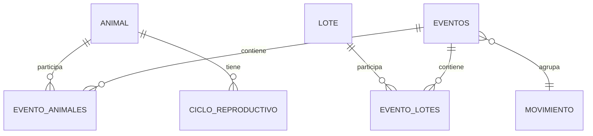
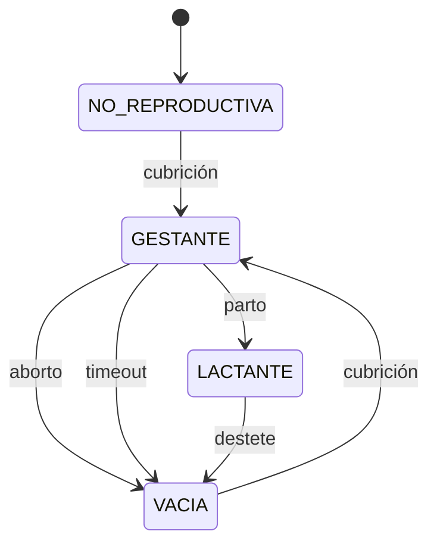
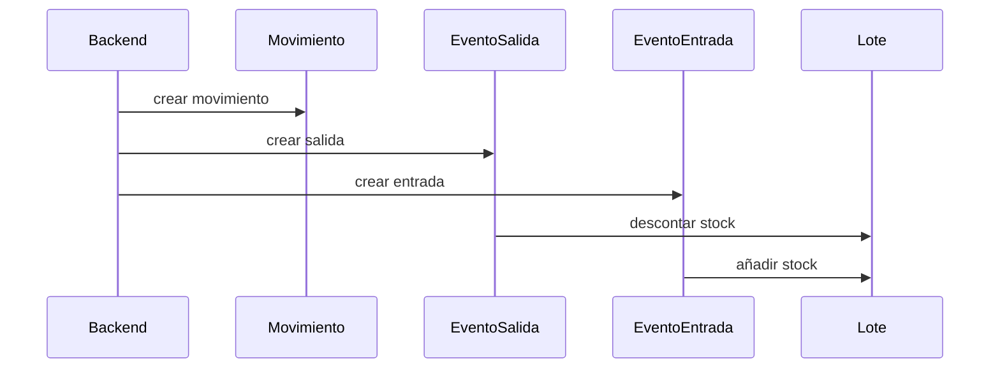
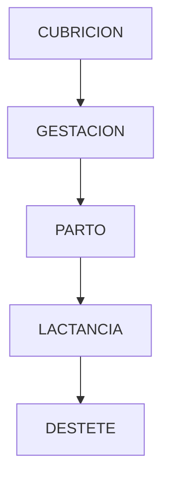

## 📄 `ganadero.md`

# 🐄 Modelo Ganadero

## Objetivo

El modelo ganadero representa la realidad física de la explotación.

Su función es modelar:
- animales,
- lotes,
- reproducción,
- movimientos,
- estados,
- stock,
- eventos físicos.

---

# 🧠 Filosofía del modelo

El sistema NO modela únicamente entidades.

Modela:
- hechos físicos,
- evolución temporal,
- relaciones históricas.

El modelo está basado en:

```txt
EVENTOS → generan realidad derivada
```

Por tanto:

```txt
stock
estado
ciclo
situación sanitaria
```

son derivados.

---

# 🧬 Entidades principales



---

# 🐖 Animal

## Qué representa

Un individuo físico.

Ejemplos:
- cerda reproductora
- lechón
- macho reproductor

---

## Estados del animal

### Estado vital

| Estado | Significado |
|---|---|
| VIVO | Animal activo |
| MUERTO | Animal fallecido |
| VENDIDO | Animal fuera de explotación |

---

### Estado sanitario

| Estado | Significado |
|---|---|
| SANO | Sin incidencias |
| EN_OBSERVACION | Posible problema |
| EN_TRATAMIENTO | Tratamiento activo |
| NO_APTO | Fuera de circuito productivo |

---

### Estado reproductivo

| Estado | Significado |
|---|---|
| NO_REPRODUCTIVA | Aún no reproductora |
| VACIA | Sin gestación |
| GESTANTE | Gestación activa |
| LACTANTE | Lactancia activa |

---

# 🔄 Máquina de estados reproductiva



---

# 🔒 Reglas críticas

## Solo hembras reproductoras

```txt
sexo != hembra
→ estado_reproductivo = NULL
```

---

## Estados derivados

Los estados:
- NO se editan manualmente
- derivan de eventos

---

## Estado vital manda

```txt
MUERTO o VENDIDO
→ invalida cualquier otro estado
```

---

# 📦 Lotes

## Qué representan

Agrupaciones físicas de animales.

Ejemplos:
- camada
- lote de engorde
- lote post-destete

---

# Tipos de lote

| Tipo | Significado |
|---|---|
| camada | recién nacidos |
| post-destete | transición |
| engorde | fase final |

---

# 🧮 Stock

## Principio clave

El lote NO es fuente de verdad.

El stock se deriva de eventos.

```txt
cantidad_actual =
Σ entradas - Σ salidas + Σ ajustes
```

---

# 🔄 Movimientos

## Qué representan

Operaciones coordinadas entre lotes.

Ejemplo:

```txt
Lote A → Lote B
```

se modela como:

```txt
EVENTO salida
EVENTO entrada
```

agrupados bajo:

```txt
MOVIMIENTO
```

---

# 🧭 Flujo de movimiento



---

# 🧬 Ciclo reproductivo

## Qué representa

Agrupa todos los eventos reproductivos relacionados.

Ejemplo:

```txt
cubrición
→ parto
→ destete
```

---

# 🔒 Invariantes reproductivas

| Regla | Descripción |
|---|---|
| 1 ciclo abierto | máximo un ciclo activo |
| Parto requiere gestación | no puede haber parto sin cubrición |
| Destete requiere parto | coherencia temporal |

---

# 📊 Relación eventos-ciclo



---

# 🧱 Validaciones críticas

## Backend

El backend valida:
- transiciones
- stock
- coherencia temporal
- ciclos

---

## Base de datos

La BD protege:
- FK
- constraints
- unicidad
- stock >= 0

---

# ⚠️ Edge cases importantes

## Muerte en gestación

```txt
GESTANTE → MUERTO
```

El estado reproductivo deja de importar.

---

## Enfermedad durante lactancia

Permitido:

```txt
LACTANTE + EN_TRATAMIENTO
```

Los estados sanitarios y reproductivos son independientes.

---

## Stock insuficiente

Nunca permitir:

```txt
salida > cantidad_actual
```

---

# 🧠 Filosofía final

El modelo ganadero representa:

```txt
realidad física
histórico
trazabilidad
consistencia temporal
```

NO busca:
- simplicidad artificial
- automatismos opacos
- estados editables manualmente

Busca:
- coherencia
- auditabilidad
- reconstrucción histórica
