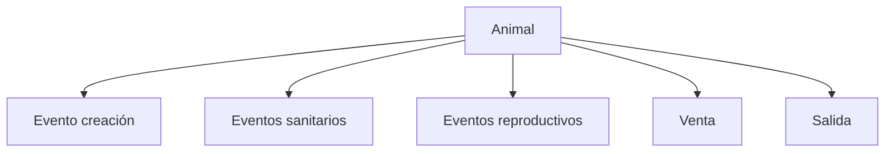
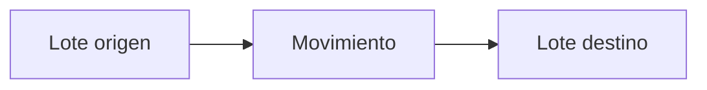
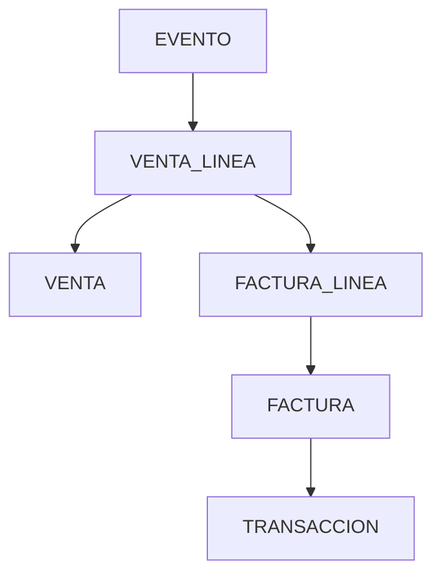
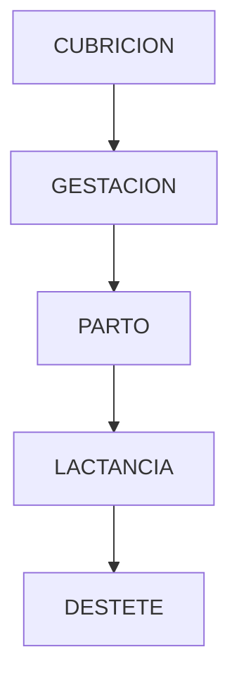
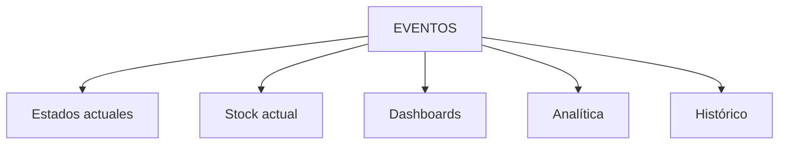

## 📄 `trazabilidad.md`

# 🔗 Modelo de Trazabilidad

# Objetivo

La trazabilidad permite reconstruir:
- qué ocurrió,
- cuándo ocurrió,
- a qué afectó,
- cómo evolucionó.

Es uno de los pilares del sistema.

---

# 🧠 Filosofía

Nada importante debe perderse.

El sistema debe permitir:

```txt
reconstrucción histórica completa
```

---

# 🧱 Qué debe poder trazarse

| Dominio | Qué debe poder reconstruirse |
|---|---|
| Animal | origen y evolución |
| Lotes | movimientos y stock |
| Reproductivo | ciclos y eventos |
| Financiero | venta y dinero |
| Documental | facturas y tickets |

---

# 🐄 Trazabilidad animal

## Flujo



---

# 📦 Trazabilidad de lotes

## Flujo



---

# 💰 Trazabilidad financiera

## Flujo completo



---

# 🔥 venta_linea como puente

La trazabilidad económica depende de:

```txt
factura_linea.venta_linea_id
```

Porque conecta:

```txt
factura
→ venta
→ evento
→ animal/lote
```

---

# 🧬 Trazabilidad reproductiva



---

# 📄 Trazabilidad documental

## Tabla única

```txt
documentos
```

---

# 🔗 Asociación documental

```txt
entidad_tipo
entidad_id
```

---

# 📦 Ejemplos

| Documento | Asociado a |
|---|---|
| Factura PDF | factura |
| Ticket | transacción |
| Imagen animal | animal |
| Informe | evento |

---

# 🔒 Inmutabilidad histórica

## Eventos

Nunca:
- editar,
- borrar.

---

## Transacciones

Nunca:
- modificar histórico.

---

# ⚠️ Correcciones

Las correcciones se realizan mediante:

```txt
eventos compensatorios
```

o:

```txt
transacciones correctoras
```

---

# 🧱 Reconstrucción histórica

El sistema debe permitir responder:

## Animal

```txt
¿de dónde viene?
¿qué tratamientos tuvo?
¿en qué lotes estuvo?
¿cuándo se vendió?
```

---

## Económico

```txt
¿qué factura corresponde?
¿qué venta originó el ingreso?
¿qué animales incluye?
```

---

## Reproductivo

```txt
¿cuántos ciclos tuvo?
¿cuántos partos?
¿abortos?
¿timeouts?
```

---

# 🧠 Trazabilidad vs estado

## Importante

Los estados NO son históricos.

El histórico real vive en:

```txt
EVENTOS
```

---

# 🧭 Capas de trazabilidad



---

# 🔒 Invariantes críticas

| Regla | Descripción |
|---|---|
| Eventos inmutables | preservar histórico |
| FK válidas | trazabilidad íntegra |
| Origen obligatorio | ningún animal aparece |
| Stock coherente | reconstrucción válida |
| No contradicción | estado compatible con eventos |

---

# 🚜 Filosofía final

La trazabilidad NO es una funcionalidad secundaria.

Es:
- la base del histórico,
- la auditoría,
- la analítica,
- la coherencia,
- la confianza en el sistema.

Sin trazabilidad:

```txt
el sistema pierde credibilidad
```
